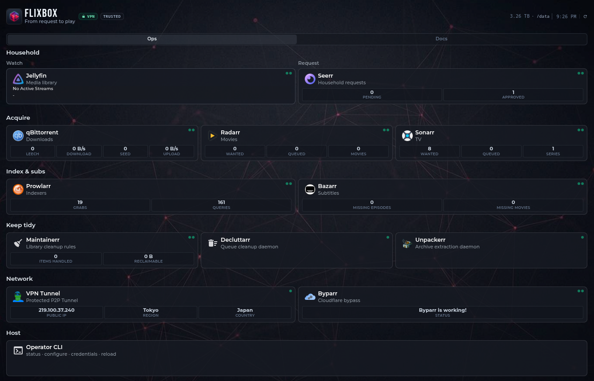

<p align="center">
  
</p>

<h1 align="center">Flixbox</h1>

<p align="center">
  <strong>Ask for a movie. Watch it on Jellyfin.</strong><br>
  One CLI, one library, optional VPN — without babysitting Compose.
</p>

<p align="center">
  <a href="LICENSE"></a>
  <a href="https://github.com/aleaz/flixbox/actions/workflows/ci.yml"></a>
  <a href="docs/user/04-install.md"></a>
</p>

<p align="center">
  <a href="README.es.md">Español</a> ·
  <a href="docs/user/INDEX.md">User guide</a> ·
  <a href="docs/user/04-install.md">Install</a>
</p>

---

## How it works

**Someone requests a title → it downloads → it appears in Jellyfin.**

| | Stage | What runs |
| --- | --- | --- |
| **1** | **Ask** | Seerr → Radarr / Sonarr (+ Prowlarr) |
| **2** | **Download** | qBittorrent — Direct, or through Gluetun in VPN mode |
| **3** | **Watch** | Hardlink into `/data/media` → Jellyfin |

No Pi-hole or reverse proxy required to get started. Full diagram: [How it works](docs/user/02-how-it-works.md).

---

<p align="center">
  
</p>

<p align="center"><em>Your stack as an ops console — the pipeline above, on one screen.</em></p>

## From zero to running

<p align="center">
  
</p>

Cold start on the CLI: `cp .env.example .env`, `init`, `up`, `status`, then `configure` wires the apps.

## Why Flixbox?

- **Request → watch** — ask in Seerr; Flixbox finds a release, downloads it, and lands it in Jellyfin
- **Same disk, no double copy** — downloads and library share one `/data` tree (hardlinks)
- **Direct today, VPN tomorrow** — flip modes without rewiring Radarr / Sonarr
- **Four commands** — `init`, `up`, `configure`, `status` via `./bin/flixbox`
- **Hygiene without surprises** — Decluttarr and Maintainerr with conservative defaults
- **Honest timing** — ~15 minutes to a running stack; add Prowlarr indexers after (not zero-touch)

## Quick start

**Need:** Docker Compose v2, **4 GB RAM floor / 8 GB comfortable**, Linux x86_64/ARM64 (macOS best-effort). Full list: [Requirements](docs/user/03-requirements.md).

**1. Clone and set paths**

```bash
git clone https://github.com/aleaz/flixbox.git
cd flixbox
cp .env.example .env
# Edit DATA_DIR, CONFIG_DIR (writable), FLIXBOX_MODE, TZ
# Optional: FLIXBOX_ACCESS_PROFILE=shared for roommates on the same Wi‑Fi
```

**2. Bring the stack up**

```bash
./bin/flixbox init --non-interactive
./bin/flixbox up
./bin/flixbox status
```

**Expected:** Homepage at http://localhost:3000 · Seerr `:5055` · Jellyfin `:8096` · qBittorrent `:8080`

**Logins:** `init` generates passwords into `.env`. Reveal without opening the file:

```bash
./bin/flixbox credentials show qbit    # qBittorrent WebUI
./bin/flixbox credentials show admin   # Jellyfin admin (when set)
```

Full map: [Credentials and API keys](docs/user/06-configuration.md#credentials-and-api-keys).

**3. Wire the apps**

```bash
./bin/flixbox configure
```

Then add Prowlarr indexers (~10–15 min): [First-run guide](docs/user/05-first-run.md).

**You’re done when:** `status` healthy · `configure` with **0 failed** · ≥1 indexer · Seerr request hits *arr · plays in Jellyfin — details in [First-run](docs/user/05-first-run.md#youre-done-when).

**Tip:** On Linux, create and `chown` your data paths first (defaults use `/srv/flixbox/…`), or point `.env` at paths you already own — [Install — storage paths](docs/user/04-install.md#storage-paths-and-permissions).

## Choose your path

| Path | When | Start here |
| --- | --- | --- |
| **First try (Direct)** | LAN only, learn the flow | [Install](docs/user/04-install.md) |
| **Shared Wi‑Fi** | Roommates on the same LAN | `FLIXBOX_ACCESS_PROFILE=shared` — [Access profiles](docs/user/13-access-profiles.md) |
| **Privacy (VPN)** | Production torrents | [VPN and Direct](docs/user/07-vpn-and-direct.md) |
| **HTTPS** | Reverse proxy | Caddy profile in [Configuration](docs/user/06-configuration.md) |
| **+ Plex** | Alongside or instead of Jellyfin | `./bin/flixbox up plex` |

## Documentation

| Doc | Purpose |
| --- | --- |
| [User guide](docs/user/INDEX.md) | Operator hub |
| [Install](docs/user/04-install.md) | Clone → `init` → `up` |
| [First-run](docs/user/05-first-run.md) | `configure` + indexers |
| [Quick reference](docs/user/REFERENCE.md) | URLs, ports, CLI cheat sheet |
| [Troubleshooting](docs/user/10-troubleshooting.md) | Common failures |

**Contributors:** [Docs map](docs/INDEX.md) · [ADRs](docs/adr/) · [AGENTS.md](AGENTS.md) · [Doc style](docs/00-doc-style.md)

**Español:** [README.es.md](README.es.md) · [Guía (ES)](docs/es/user/INDEX.md)

<details>
<summary><strong>What’s included</strong></summary>

Gluetun, qBittorrent, Prowlarr, Byparr, Radarr, Sonarr, Bazarr, Unpackerr, Recyclarr, Decluttarr, Maintainerr, Seerr, Jellyfin, Homepage, Caddy (optional), docker-socket-proxy (with Homepage).

Defaults follow [TRaSH Guides](https://trash-guides.info/) where they apply. Platforms: Linux first-class (x86_64 / ARM64); Windows (Docker Desktop + WSL2) and macOS best-effort.

</details>

## License

[MIT](LICENSE) © 2026 Alejandro Azario

## Disclaimer

> The authors **do not condone** copyright infringement. **Flixbox does not develop** qBittorrent, Radarr, Sonarr, Jellyfin, or the other apps in the stack — it only **assembles and wires** existing third-party tools. **Use at your own risk:** you alone choose content, indexers, and VPN settings and bear legal and operational responsibility. Flixbox is **not affiliated with** those upstream projects. Provided **AS IS** under the [MIT License](LICENSE).

Full notice (EN/ES): [Legal disclaimer](docs/user/16-legal-disclaimer.md) · [Aviso legal](docs/es/user/16-legal-disclaimer.md)
