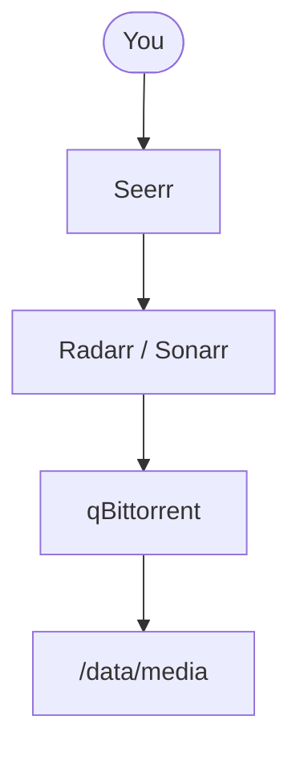

# Flixbox documentation style guide

**Status:** Working Draft  
**Audience:** Anyone writing README, `docs/user/`, or visual assets for Flixbox.  
**Brand source of truth:** Homepage theme — `templates/homepage/custom.css` (and `templates/homepage/images/logo.png`).

This guide unifies **tone**, **page shape**, and **visual language** so the repo feels like one product (not a pile of engineering notes). Engineering precision stays in ADRs and `docs/05-standards.md`; this file owns **how we present Flixbox to operators**.

## 1. Brand tokens (match Homepage)

Use these when designing diagrams, README hero frames, slide stills, or thumbnail cards. GitHub Markdown cannot load custom fonts in prose, but **exported images and GIFs must**.

| Token | Value | Use |
| --- | --- | --- |
| Brand type | **Bebas Neue** | Wordmark “FLIXBOX” only |
| UI type | **Montserrat** (500–700) | Labels, captions, diagram text |
| Background | `#0b0d13` | Diagram / mock canvas |
| Card | `rgba(22, 26, 35, 0.80)` ≈ `#161a23` | Panels in composites |
| Border | `rgba(255, 255, 255, 0.12)` ≈ stroke `#2a303c` | Soft separators |
| Text primary | `#f0f6fc` | Titles |
| Text secondary | `#8b949e` | Body / captions |
| Text muted | `#6e7681` | Hints |
| Healthy | `#10b981` | Status OK / main happy path |
| Warning | `#f59e0b` | Caution / VPN boundary |
| Danger | `#f43f5e` | Fail / ban / leak |

**Do not** invent a second palette (no purple SaaS gradients, no cream/serif “editorial” look) for Flixbox marketing assets. Align with the Ops dashboard the operator already sees.

**Logo:** prefer `templates/homepage/images/logo.png` (copy into `docs/images/shared/` when publishing README/docs so paths stay stable under `docs/images/`).

## 2. Voice and promises

### Principles

1. **Benefit before inventory** — say what the operator gains; list services second.
2. **Honest time** — give ranges (`~15 min` up, indexers after). Never imply zero-touch.
3. **Show, then tell** — screenshot / diagram / CLI tape before long command walls when possible. Diagram medium: see [§7 Diagram style line](#7-diagram-style-line).
4. **One audience per layer** — README + `docs/user/` = operators; `docs/adr/` + engineering map = contributors.

### Prefer / avoid

| Prefer (operator) | Avoid in entry docs (too early) |
| --- | --- |
| “Four commands: init, up, configure, status” | “Bash orchestration and Compose modularity” |
| “Same disk for downloads and library — no double copy” | “Hardlink contract / ADR 0001” as the first sentence |
| “Flip to VPN without rewiring Radarr/Sonarr” | Leading with `network_mode: service:gluetun` |
| “Hygiene that does not delete by surprise” | Dumping Decluttarr env var tables in the README hero |

ADRs and contract IDs belong in engineering docs, troubleshooting deep links, and “see also” — not the first screen of the README.

## 3. User-guide page template

Use this shape for new or heavily revised pages under `docs/user/` (especially overview, how-it-works, install, first-run):

1. **At a glance** — one short paragraph + up to three bullets (outcome, who, time).
2. **Before you start** — only the requirements that matter for *this* page.
3. **Steps** — numbered, one primary action per step.
4. **Verify** — how the operator knows it worked (URL loads, `status` healthy, log line, etc.).
5. **If it fails** — two to four common failures with links to [Troubleshooting](user/10-troubleshooting.md).
6. **Next** — single clear link forward.

Keep REFERENCE and deep configuration pages more tabular; they do not need a marketing hero.

## 4. Callouts (consistent labels)

In English canonical docs, lead the blockquote or paragraph with a fixed label:

- **Tip:** shortcut or optional path  
- **Important:** contract / must-not-break (e.g. `/data`, `qbittorrent:8080`)  
- **Warning:** footgun (ban, shared Wi‑Fi, public bind)  
- **Expected:** what success looks like after a step  

Do not invent new label vocabularies per page.

## 5. Commands and verify

- Prefer `./bin/flixbox …` over raw `docker compose` in operator docs.  
- One command (or one short block) per step when teaching.  
- After non-obvious steps, add **Expected:** (status healthy, Homepage at `:3000`, etc.).  
- Never paste real passwords, API keys, or personal media titles into screenshots or tapes.

## 6. README shape (product face)

Target section order for the root `README.md` (implement when assets exist):

1. Wordmark / logo + one-line USP  
2. Badges (license, CI)  
3. Hero visual (Homepage screenshot and/or CLI tape)  
4. Why Flixbox (benefit bullets)  
5. How it works (short table or Mermaid link — not a large raster hero)  
6. Quick start (three steps max)  
7. Choose your path (Direct / shared / VPN / HTTPS)  
8. Docs hub links  
9. What’s included (`
`)  
10. License + disclaimer  

Full service inventory and ADR indexes stay out of the hero.

## 7. Diagram style line

One visual language for **all** diagrams in the repo (operator guide, architecture, CI, plans). Pick the **medium** first, then apply shared **structure** rules.

### 7.1 Medium (when to use what)

| Medium | Use for | Do not use for |
| --- | --- | --- |
| **Mermaid** (default) | Pipelines, hardlink layout, VPN vs Direct, sequences, CI graphs, system context | Pixel-perfect brand marketing |
| **Screenshot / GIF** | Real UIs and CLI demos (Homepage Ops, `cli-quickstart.gif`) — these *are* the dashboard look | Invented “mock” product chrome |
| **PNG + SVG** | Rare: only if Mermaid cannot express a layout after a real try | Conceptual diagrams that fight GitHub light/dark (dark canvases look pasted-on) |
| **ASCII tree** | Tiny path snippets when Mermaid is overkill | A second full diagram next to Mermaid |

**Rule:** never ship **Mermaid + ASCII + PNG** for the same idea. One primary diagram; optional short caption.

**Do not** invent dark “dashboard-like” PNG diagrams for concepts — they clash with GitHub’s theme and are not the real Homepage. Prefer Mermaid (same family as other docs diagrams) or a real screenshot.

### 7.2 Shared structure (every diagram)

1. **One job** — one question answered (e.g. “how does a title move?”, not “whole stack + CI + VPN”).
2. **Top → bottom reading** — prefer `flowchart TB` for pipelines and sequences. Use **`LR` for side-by-side layouts** (e.g. torrents ↔ media hardlink, Direct vs VPN columns).
3. **Product names** — `Seerr`, `qBittorrent`, `Jellyfin`, `Prowlarr` (not `jf`, `qbit` as visible labels). Node **ids** may be short (`qbit`, `arr`).
4. **Main path = solid** edges. **Optional / mode / hygiene / bypass = dotted** (`-. label .->`) with a **2–4 word** label.
5. **Paths and hosts** in quotes or monospace-friendly labels: `"/data/torrents"`, `"qbittorrent:8080"`.
6. **No emoji**, no marketing badges, no ADR numbers inside nodes (link ADR in prose under the diagram).
7. **Actor** = stadium/circle (`You([You])`); **services** = rectangles; **data** = rectangle with path string.
8. **Caption under the figure** in prose when the diagram alone is ambiguous (one sentence max).

### 7.3 Mermaid conventions

| Convention | Do | Avoid |
| --- | --- | --- |
| Direction | `flowchart TB` for pipelines; `LR` for side-by-side layouts | Mixing directions without a layout reason |
| Labels | Short edge labels on dotted links | Long sentences on arrows |
| Subgraphs | Only when they name a real boundary (`Flixbox suite`, `Triggers`) | Decorative nesting |
| Sequence | `sequenceDiagram` for day-2 protocols (credentials rotate) | Using sequence for the request→watch pipeline |
| C4 | Do **not** use `C4Context` / `C4Container` in shipped docs | Pastel default fills on GitHub (celeste/azul) break brand tokens |
| Theme | Rely on GitHub light/dark; **do not** depend on `%%{init}%%` brand colors (GitHub may ignore/retheme) | Fighting GitHub with huge `themeVariables` blocks |

Plans and engineering notes follow the same rules when adding or revising diagrams.

### 7.4 Screenshots and rare exports

**Screenshots / GIFs** (Homepage, CLI tape) are the dashboard look — capture the real UI; do not redraw it.

**Rare conceptual PNG/SVG** (only if Mermaid fails after a real try): match [§1 Brand tokens](#1-brand-tokens), keep `.svg` beside `.png`, max ~960px. Prefer not to ship these in operator docs.

Checklist and paths: [images/README.md](images/README.md).

## 8. Visual assets

Naming, folders, and i18n rules: [images/README.md](images/README.md).  
Capture priorities and CLI tape script: same file, **Brand-first capture checklist**.

## 9. Relationship to other docs

| Doc | Owns |
| --- | --- |
| This file | Operator-facing tone, page shape, brand tokens, **diagram style line** |
| [05-standards.md](05-standards.md) | Engineering writing, git commit rules, Compose/shell standards |
| [user/INDEX.md](user/INDEX.md) | Operator reading order |
| [AGENTS.md](../AGENTS.md) | AI/agent hard constraints |

When brand tokens in Homepage CSS change, update **§1** here and re-export affected PNG/SVG diagrams/screenshots.
