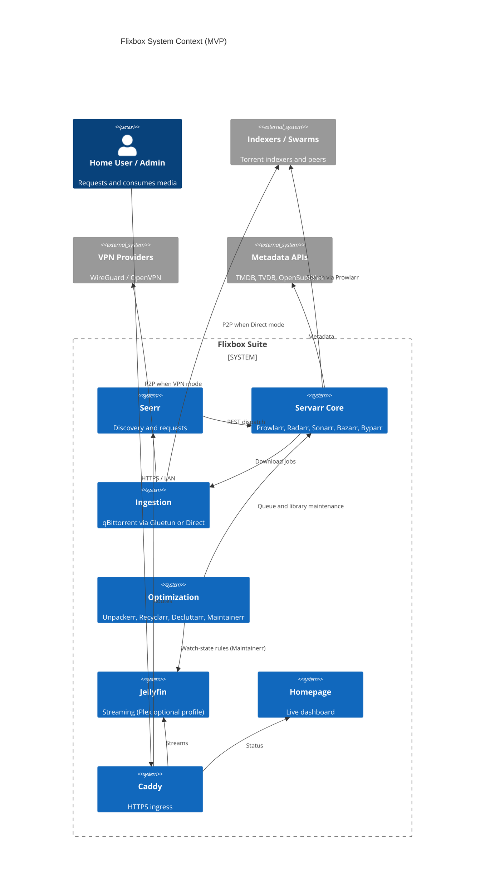

# Architecture

**Status:** Working Draft  
**Audience:** Contributors and AI agents implementing Flixbox  
**Related:** [01-scope.md](01-scope.md), [adr/](adr/)

## 1. Summary

Flixbox is a modular Docker Compose suite that automates media request, download, organization, maintenance, and streaming for home use. Pillars:

1. **Single-volume `/data` hardlink contract** (TRaSH-aligned)
2. **Gluetun VPN or Direct networking** (dual mode; torrent only in VPN netns)
3. **Compose v2 modularity** (`include:` + profiles)
4. **Linux-first portability** (WSL2/macOS best-effort)
5. **Bash CLI** for bootstrap and day-2 ops (`bin/flixbox`)
6. **Quality + queue + library automation** (Recyclarr, Unpackerr, Decluttarr, Maintainerr)

Immutable decisions are recorded as ADRs.

## 2. System context (C4)



## 3. Layered topology

| Layer | Components (MVP) |
| --- | --- |
| Ingress | Caddy |
| UX | Homepage, Seerr, Jellyfin (+ optional Plex) |
| Automation | Prowlarr, Radarr, Sonarr, Bazarr, Byparr |
| Optimization / hygiene | Unpackerr, Recyclarr, Decluttarr, Maintainerr |
| Ingestion | Gluetun + qBittorrent **or** qBittorrent Direct |
| Host | Docker Engine, `bin/flixbox`, optional host tuning |

## 4. Networking

### 4.1 VPN mode (`VPN_ENABLED=true`)

- Gluetun owns the tunnel (`NET_ADMIN`, `/dev/net/tun`).
- qBittorrent uses `network_mode: "service:gluetun"`.
- **Publish qBittorrent WebUI (and BT ports as needed) on the Gluetun service**, not on qBittorrent.
- Servarr / Decluttarr download-client URL: `http://gluetun:8080`.
- Start order: Gluetun healthy → then qBittorrent.
- Killswitch: qBit has no independent netns; egress drops if tunnel/firewall fails.
- Default: DoT on; `BLOCK_IPV6=on` unless explicit IPv6 VPN is configured.
- Port forwarding (when provider supports it): `VPN_PORT_FORWARDING=on` plus Gluetun `VPN_PORT_FORWARDING_UP_COMMAND` / `DOWN_COMMAND` to update qBittorrent listen port via localhost WebAPI (bypass auth for localhost).

### 4.2 Direct mode (`VPN_ENABLED=false`)

- Gluetun is not started.
- qBittorrent joins `flixbox_net`.
- Servarr / Decluttarr download-client URL: `http://qbittorrent:8080`.

### 4.3 Anti-pattern (forbidden)

Do **not** put Radarr, Sonarr, Prowlarr, Seerr, Jellyfin, or Bazarr into `network_mode: service:gluetun`. They must stay on `flixbox_net` for LAN metadata APIs and sane service discovery. Only the torrent client is VPN-isolated.

### 4.4 Bridge

User-defined bridge `flixbox_net` for all non-VPN-netns services.

## 5. Storage contract

All containers that touch downloads or libraries mount **the same parent**:

`${DATA_DIR}:/data`

```
Host: ${DATA_DIR}/                  Container: /data/
├── torrents/
│   ├── incomplete/   # qBittorrent incomplete
│   ├── movies/
│   └── tv/
└── media/
    ├── movies/       # Radarr hardlinks here
    └── tv/           # Sonarr hardlinks here
```

**Permissions model (frozen — simpler TRaSH variant):**

- Single shared `PUID`/`PGID` (default `1000`/`1000`) for linuxserver-style apps.
- `UMASK=002` plus SGID on data dirs so group-write survives across containers.
- Not the TRaSH “per-app UID + shared group” model; documented as intentional simplicity.

**Rules:**

- Hardlinks require the same filesystem device (avoid MergerFS/Unraid/`exFAT` pitfalls).
- `/config` on **local SSD/NVMe only** — never NFS/SMB.

## 6. Compose layout

Downloader VPN vs Direct is selected by `FLIXBOX_MODE` (exclusive `include`), not Compose profiles.

```
compose/
├── network-base.yml
├── downloaders-vpn.yml
├── downloaders-direct.yml
├── servarr.yml              # Prowlarr, Radarr, Sonarr, Bazarr, Byparr
├── optimization.yml         # Unpackerr, Recyclarr, Decluttarr, Maintainerr
├── media-servers.yml        # Jellyfin; Plex via profile
├── requests.yml             # Seerr
├── dashboard.yml
└── proxy.yml
```

## 7. Hygiene pair

| App | Job |
| --- | --- |
| **Decluttarr** | Download-queue health: stalled/slow/failed/orphan → remove, blocklist, re-search |
| **Maintainerr** | Library health: rule-based cleanup using Jellyfin watch state + Radarr/Sonarr |

See [ADR 0008](adr/0008-maintenance-decluttarr-maintainerr.md).

## 8. CLI (MVP)

`bin/flixbox` (Bash): `init`, `up`, `down`, `restart`, `status`, `logs`, `vpn-test`.

## 9. Security baseline

- No credentials in git.
- Non-root app containers via PUID/PGID where applicable; Seerr runs as UID 1000 with `init: true`.
- Optional docker-socket-proxy for Homepage.
- Caddy for TLS; SSO/Authelia is post-MVP.
- Future CI: gitleaks + image scanning (roadmap).

## 10. Resilience baseline

- `stop_grace_period: 60s` on stateful services.
- Healthcheck-gated depends_on for Gluetun → qBittorrent.
- Host inotify / socket buffer tuning via `scripts/host-tuning.sh`.
