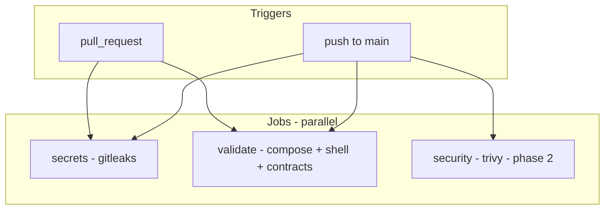

# Continuous integration plan (GitHub Actions)

**Status:** Working Draft — last validated 2026-09-02  
**Related:** [05-standards.md](05-standards.md) · [06-development-guide.md](06-development-guide.md) (phase 7) · [08-roadmap.md](08-roadmap.md) · [ADR 0003](adr/0003-compose-modularity.md) · [ADR 0006](adr/0006-mvp-service-inventory.md)

## 1. Purpose

Flixbox is a **Compose + Bash CLI + documentation** project. There is no application build step, no unit-test suite, and no first-party container images to publish.

CI must therefore focus on:

1. **Preventing secrets in git** (VPN keys, API tokens, `.env` leaks).
2. **Enforcing frozen architecture contracts** (storage layout, VPN dual-mode, service inventory).
3. **Validating Compose and shell scripts** before merge.
4. **Scanning third-party images** for known vulnerabilities (advisory until tags are pinned).

CI must **not** attempt full stack E2E (`docker compose up` + healthchecks) on every PR — too slow, flaky, and dependent on provider credentials.

---

## 2. Repository baseline (validated)

The following was checked against the tree at commit `30a51fc` and local tooling.

### 2.1 Files CI will touch

| Path | Role |
| --- | --- |
| `compose.yaml` | Root `include:` project |
| `compose/*.yml` | 9 modules; all ≤150 lines |
| `.env.example` | Env template for `docker compose config` |
| `bin/flixbox` | CLI (~430 lines) |
| `scripts/*.sh` | Host helpers + CI scripts + configure orchestrator |
| `scripts/configure/*.sh` | Per-service configure modules |
| `scripts/lib/*.sh` | Shared configure helpers, state machine, env tools |
| `scripts/lib/*.py` | `json-payload.py` (payload builder) + `json-query.py` (named queries) |
| `templates/` | Copied by `init`; no runtime secrets |

### 2.2 Compose services (expected)

**Always active** (`FLIXBOX_MODE=direct`):

`bazarr`, `byparr`, `decluttarr`, `homepage`, `jellyfin`, `maintainerr`, `prowlarr`, `qbittorrent`, `radarr`, `seerr`, `sonarr`, `unpackerr`

**VPN mode adds:** `gluetun` (qBittorrent remains; shares Gluetun netns)

**Profile-gated** (not in default `config --services` unless profile enabled):

| Profile | Service |
| --- | --- |
| `plex` | `plex` |
| `proxy` | `caddy` |
| `socket-proxy` | `docker-socket-proxy` |
| `recyclarr` | `recyclarr` |

### 2.3 Third-party images

Compose modules pin **explicit version tags** (no `:latest`). Canonical inventory: [docs/user/14-image-pins.md](user/14-image-pins.md) ([ADR 0010](adr/0010-mit-and-image-tags.md)). CI contract `C-43` fails if any `image: …:latest` remains under `compose/`.

Trivy image scans use the pinned tags from that inventory.
### 2.4 Tooling on GitHub-hosted runners

| Tool | Ubuntu runner | Notes |
| --- | --- | --- |
| Docker Compose v2 | Preinstalled | Validated locally: Compose 5.x |
| `shellcheck` | Install via `apt` or action | Not in repo; CI installs it |
| `gitleaks` | Official action | Full history scan on PR |
| `trivy` | Official action | Config + image scan |

---

## 3. Non-goals

Do **not** add CI jobs for:

- Building or pushing Flixbox-owned images (none exist).
- Deploying stacks to remote hosts.
- Pulling and starting all containers on every push (runtime credentials, port conflicts, minutes cost).
- PowerShell CLI lint (out of scope per ADR 0006).
- Kubernetes / Helm validation.

---

## 4. Workflow layout

Single workflow file: `.github/workflows/ci.yml`



### 4.1 Job: `secrets` (phase 1 — required)

**Goal:** Block commits containing credentials.

| Step | Action |
| --- | --- |
| Checkout | `actions/checkout@v4` with `fetch-depth: 0` |
| Scan | `gitleaks/gitleaks-action@v2` |

**Policy:** Fail the job on any leak. No baseline exceptions for `.env.example` placeholders (they use empty values, not real keys).

**Branch protection:** Required check before merge to `main`.

---

### 4.2 Job: `validate` (phase 1 — required)

**Goal:** Prove Compose resolves and scripts/contracts hold.

| Step | Command / check |
| --- | --- |
| Checkout | `actions/checkout@v4` |
| Compose render | `./scripts/ci-compose-render.sh` (direct, VPN, profiles, shared access profile) |
| ShellCheck | `shellcheck bin/flixbox scripts/*.sh scripts/configure/*.sh …` |
| Contract script | `./scripts/ci-validate.sh` (includes compose render + C-01…C-71) |
| Init smoke | `./scripts/ci-smoke-init.sh` |

**Env for CI:** Use `.env.example` as-is with `DATA_DIR` / `CONFIG_DIR` overridden inside `ci-validate.sh` to `/tmp/flixbox-ci/{data,config}` so runners never touch `/srv/flixbox`.

**Branch protection:** Required check.

---

### 4.3 Job: `security` (phase 2 — recommended before v0.1 tag)

**Goal:** Surface misconfigurations and CVEs in upstream images.

| Step | Tool | Scope |
| --- | --- | --- |
| Config scan | `aquasecurity/trivy-action` | `compose/` + `compose.yaml` |
| Image scan | Same | Images extracted from compose (see §5.3) |

**Policy (pre-pin):**

- `CRITICAL`: warn in PR comment or job summary; do not block until image pins exist.
- After pin policy in ADR 0010 is enforced: upgrade to **block on CRITICAL** for pinned digests.

**Schedule:** Run on every push to `main` + weekly `cron` (image CVEs change without code changes).

---

## 5. Contract validation script

New file: `scripts/ci-validate.sh`

Must exit non-zero on violation. Designed to run locally and in CI.

### 5.1 Compose structure (ADR 0003)

| ID | Rule | Validation |
| --- | --- | --- |
| C-01 | No compose file >150 lines | `wc -l compose/*.yml compose.yaml` |
| C-02 | Root uses `include:` | grep in `compose.yaml` |
| C-03 | Downloader selected by `FLIXBOX_MODE` | `downloaders-${FLIXBOX_MODE:-direct}.yml` in include |

### 5.2 Storage contract (ADR 0001)

| ID | Rule | Validation |
| --- | --- | --- |
| C-10 | Radarr/Sonarr/Bazarr/qBit mount `${DATA_DIR}:/data` | grep volumes in servarr + downloaders |
| C-11 | `torrents/incomplete` in bootstrap | `scripts/bootstrap-dirs.sh` |
| C-12 | Unpackerr uses `/data/torrents` | `optimization.yml` |

### 5.3 VPN dual-mode (ADR 0002)

| ID | Rule | Validation |
| --- | --- | --- |
| C-20 | Only qBit uses `network_mode: service:gluetun` | grep across compose; must appear only in `downloaders-vpn.yml` on `qbittorrent` |
| C-21 | *arr / Seerr / Jellyfin NOT on Gluetun netns | no `network_mode: service:gluetun` in servarr, requests, media-servers |
| C-22 | Gluetun publishes qBit ports | ports on `gluetun` service in vpn module |
| C-23 | Gluetun healthy before qBit | healthcheck on `gluetun`; qBit `depends_on` healthy |
| C-24 | qBit cont-init at `/custom-cont-init.d` | `qbittorrent-cont-init:/custom-cont-init.d` in both downloader modules + template present |
| C-25 | `flixbox_net` subnet + qBit whitelist | `172.30.42.0/24` in `network-base.yml` + AuthSubnetWhitelist in cont-init template |
| C-26 | Decluttarr idle entrypoint | `templates/decluttarr/entrypoint.sh` mounted; no password in Compose `command` |
| C-27 | qBit healthy before peers | healthcheck on both downloader modules; `depends_on` in servarr + optimization |
| C-28 | CLI warns on `FLIXBOX_MODE` / `VPN_ENABLED` mismatch | `warn_mode_vpn_mismatch` in `bin/flixbox` (`init`/`up`/`status`) |
| C-29 | VPN Gluetun `qbittorrent` network alias | `aliases: qbittorrent` on `gluetun` in `downloaders-vpn.yml` (ADR 0014) |

### 5.4 Service inventory (ADR 0006)

| ID | Rule | Validation |
| --- | --- | --- |
| C-30 | Banned image patterns absent | no `jellyseerr`, `overseerr`, `flaresolverr` in `image:` lines under `compose/` |
| C-31 | Core services present in direct config | `docker compose config --services` contains required set (§2.2) |
| C-32 | VPN adds `gluetun` | `FLIXBOX_MODE=vpn docker compose config --services` includes `gluetun` |
| C-33 | Seerr uses `init: true` | `requests.yml` |

### 5.5 Hygiene defaults (ADR 0008 / docs/09)

| ID | Rule | Validation |
| --- | --- | --- |
| C-40 | Decluttarr protect tag | `PROTECTED_TAG: flixbox-keep` (Decluttarr v2) or legacy `NO_STALLED_REMOVAL_QBIT_TAG` in `optimization.yml` |
| C-41 | Decluttarr unmonitored off | `REMOVE_UNMONITORED: "False"` |
| C-42 | Stateful `stop_grace_period` | grep count ≥ expected minimum on long-running services |
| C-43 | No `:latest` image tags | grep `compose/*.yml` for `:latest` (ADR 0010) |
| C-61 | Configure JSON payload contract | `json-payload.py` + `configure-runtime.sh`; no shell-interpolated secrets in `configure-apps.sh`; qBit login via stdin script (not `docker exec` argv) |
| C-62 | Configure module layout | `scripts/configure/*.sh` sourced from `configure-apps.sh`; unified `scripts/lib/flixbox-env.sh` |
| C-63 | Access profile recreate + UI sync | `configure-entry` recreate on drift; `FLIXBOX_ARR_UI_*` on init/`shared`; ADR 0015 |
| C-64 | CI workflow alignment | `ci-compose-render.sh` shared render; `security` job + `ci-trivy.sh`; Dependabot for Actions |
| C-65 | Operator docs + Maintainerr pack | `rule-pack.md` copied by init; `15-credential-rotation.md`; ADR 0011 ES scope |
| C-66 | `.env.example` access-profile keys | Active `FLIXBOX_ARR_AUTH_*`, `FLIXBOX_ADMIN_BIND_IP`, `FLIXBOX_ARR_UI_*` assignments (in-place sync) |
| C-67 | Configure first-start wait order | `configure_wait_for_first_start` before API key discovery in preflight |
| C-68 | Configure readiness state machine | `configure-state.sh` + `configure-entry.sh`; Jellyfin in core assert; soft VPN retry; wiring skips duplicate waits after preflight |
| C-69 | Configure pre-release hardening | `--dry-run` entry guard; parallel preflight waits; `fail()` returns 0 under `set -e` (PARTIAL wiring; ADR 0016); Bazarr post-restart wait |
| C-70 | Configure follow-ups | `json-query.py` param-safe queries; `configure-context.sh`; `ci-smoke-configure.sh` (Seerr, Byparr, remapped qBit port) |
| C-71 | Configure audit guards | `json_query` pipe/params; host probe vs canonical container ports; qBit API key prefs fallback |
| C-72 | Host port preflight | `preflight-host.sh`; `up`/`reload` call before compose; first-run doc |
| C-73 | Configure smoke on PR | `configure-smoke-pr` job; `CI_CONFIGURE_SMOKE_PR` subset |
| C-74 | VPN structural smoke | `ci-smoke-vpn.sh`; VPN netns + gluetun alias contract |
| C-75 | Release gate | `release.yml` with `TRIVY_BLOCK=1`; `ci-pin-digests.sh` |
| C-76 | Compose HTTP healthchecks | Prowlarr/Radarr/Sonarr/Bazarr/Jellyfin; ADR 0017 |
| C-77 | Bazarr start order | `depends_on` Sonarr/Radarr `service_healthy` |
| C-78 | Runtime secrets doc | ADR 0018; threat model in access profiles + configuration |
| C-79 | json_query migration | no `json_extract` in `scripts/configure/`; named handlers in `json-query.py` |
| C-81 | json_extract removed | no `json_extract` in configure-helpers |
| C-82 | CLI output fallbacks | `cli-output.sh` sourced by configure-entry for up/reload |
| C-83 | Port preflight UX | per-service port hints; Jellyfin/Seerr probe on 0.0.0.0 |
| C-80 | VPN ops docs | ADR 0013 Accepted; VPN drop + Gluetun recreate troubleshooting |

### 5.6 CLI smoke (phase 2 — in validate job via `scripts/ci-smoke-init.sh`)

| ID | Rule | Validation |
| --- | --- | --- |
| C-50 | `init --non-interactive` succeeds | temp `.env` with `/tmp/flixbox-ci-smoke/*` paths |
| C-51 | Templates copied | `homepage/services.yaml`, `recyclarr/recyclarr.yml`, `torrents/incomplete`, `qbittorrent/.flixbox/qbit-api-login.sh`, `maintainerr/rule-pack.md` |
| C-52 | Decluttarr qBit URL | `DECLUTTARR_QBIT_URL` is `http://qbittorrent:8080` after init (ADR 0014) |

### 5.7 Documentation links (phase 3 — optional)

| ID | Rule | Validation |
| --- | --- | --- |
| C-60 | Relative links in `docs/` resolve | `markdown-link-check` action or `lychee` |

---

## 6. Implementation phases

### Phase 1 — Merge gate (target: before public `v0.1`)

**Deliverables:**

```
.github/workflows/ci.yml          # jobs: secrets, validate (+ init smoke C-50–52)
scripts/ci-validate.sh            # C-01 through C-42
scripts/ci-smoke-init.sh          # C-50–52 + env-file unit + configure dry-run gate
scripts/ci-smoke-configure.sh     # C-70 / D5 — ephemeral stack configure (Seerr, Byparr, dynamic qBit port)
```

**Estimated runner time:** ~2–5 minutes per PR.

**Exit criteria:**

- [x] Both jobs green on `main`
- [x] Intentionally broken compose fails `validate` (manual spot-check)
- [x] Init smoke (C-50–52) in validate job
- [ ] Branch protection requires `secrets` + `validate` (GitHub repo settings)

### Phase 2 — Security visibility (before `v0.1` tag)

**Deliverables:**

```
.github/workflows/ci.yml          # jobs: secrets, validate, security (Trivy)
scripts/ci-compose-render.sh      # shared compose config render
scripts/ci-trivy.sh               # Trivy config + image scan (warn-only)
.github/dependabot.yml            # GitHub Actions ecosystem
```

**Exit criteria:**

- [x] Trivy config scan runs without error (warn-only on findings)
- [x] Image scan lists all MVP images from `docker compose config --images`
- [x] Policy documented: warn-only until pins (`TRIVY_BLOCK=1` to fail locally)
- [x] C-50–52 init smoke (in validate job)
- [x] Shared compose render includes `shared` access profile (C-64)
### Phase 3 — Docs and release hygiene (v0.2)

**Deliverables:**

```
.github/workflows/docs.yml        # link check on docs/ + README
.github/workflows/release.yml     # on tag v*: verify image pins != :latest
```

**Exit criteria:**

- [ ] No broken relative links in canonical docs
- [ ] Release workflow fails if any `image:` still uses bare `:latest`

---

## 7. Branch protection (GitHub settings)

Apply when the repository is public and CI is merged:

| Setting | Value |
| --- | --- |
| Require pull request before merging | On (recommended even for solo maintainer) |
| Required status checks | `secrets`, `validate` |
| Require branches up to date | On |
| Restrict force-push to `main` | On |

Add `security` as required only after Trivy policy moves from warn to block.

---

## 8. Local developer workflow

Before opening a PR, operators and agents should run:

```bash
./scripts/ci-compose-render.sh
./scripts/ci-validate.sh
./scripts/ci-smoke-init.sh
shellcheck bin/flixbox scripts/*.sh scripts/configure/*.sh
# Optional when trivy is installed:
./scripts/ci-trivy.sh
```

Optional: install [gitleaks](https://github.com/gitleaks/gitleaks) locally for pre-push scanning.

---

## 9. Maintenance

| Task | Frequency |
| --- | --- |
| Bump `actions/checkout`, gitleaks, trivy action versions | Quarterly or Dependabot PR |
| Reconcile `ci-validate.sh` when ADRs change | Same PR as ADR/compose change |
| Review Trivy CRITICAL on `main` | Weekly (cron job) |
| Tighten Trivy gate after image pins | Once, at v0.1 release prep |

---

## 10. Risks and mitigations

| Risk | Mitigation |
| --- | --- |
| Flaky `docker compose config` on runner | Pin Compose via documented runner image; no network pull needed for `config` |
| False positives in gitleaks on docs examples | Keep examples as placeholders; never paste real keys in docs |
| Trivy noise on `:latest` | Warn-only until pins; scan runs on schedule, not every file edit |
| Contract script drift from ADRs | Script comments reference ADR IDs; update in same PR as contract change |
| CI minutes cost | No container pull/up; three lightweight jobs |

---

## 11. Success criteria

CI implementation is complete for phases 1 + 2:

1. `.github/workflows/ci.yml` exists and passes on `main` (jobs: `secrets`, `validate`, `security`).
2. `scripts/ci-validate.sh` enforces checks C-01 through C-71.
3. Init smoke (`ci-smoke-init.sh`) runs in the `validate` job (C-50–C-52 + env-file unit + access profile).
4. Configure smoke (`ci-smoke-configure.sh`) available for opt-in E2E runs (`CI_CONFIGURE_SMOKE=1`).
5. [06-development-guide.md](06-development-guide.md) phase 7 CI items marked done.

Phase 3 adds docs link check (C-60) and release tag workflow.
