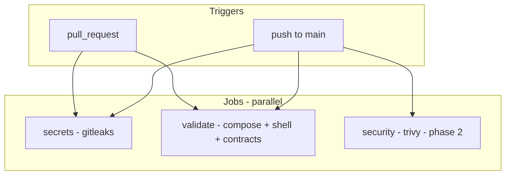

# Continuous integration plan (GitHub Actions)

**Status:** Working Draft — validated against repository state on 2026-08-27  
**Related:** [05-standards.md](05-standards.md) · [06-development-guide.md](06-development-guide.md) (phase 7) · [08-roadmap.md](08-roadmap.md) · [ADR 0003](adr/0003-compose-modularity.md) · [ADR 0006](adr/0006-mvp-service-inventory.md)

## 1. Purpose

Flixbox is a **Compose + Bash CLI + documentation** project. There is no application build step, no unit-test suite, and no first-party container images to publish.

CI must therefore focus on:

1. **Preventing secrets in git** (VPN keys, API tokens, `.env` leaks).
2. **Enforcing frozen architecture contracts** (storage layout, VPN dual-mode, service inventory).
3. **Validating Compose and shell scripts** before merge.
4. **Scanning third-party images** for known vulnerabilities (advisory until tags are pinned).

CI must **not** attempt full stack E2E (`docker compose up` + healthchecks) on every PR — too slow, flaky, and dependent on provider credentials.

---

## 2. Repository baseline (validated)

The following was checked against the tree at commit `30a51fc` and local tooling.

### 2.1 Files CI will touch

| Path | Role |
| --- | --- |
| `compose.yaml` | Root `include:` project (19 lines) |
| `compose/*.yml` | 9 modules; all ≤150 lines (max: `servarr.yml` 86, `optimization.yml` 85) |
| `.env.example` | Env template for `docker compose config` |
| `bin/flixbox` | CLI (241 lines) |
| `scripts/*.sh` | Host helpers (4 scripts, 141 lines total) |
| `templates/` | Copied by `init`; no runtime secrets |

### 2.2 Compose services (expected)

**Always active** (`FLIXBOX_MODE=direct`):

`bazarr`, `byparr`, `decluttarr`, `homepage`, `jellyfin`, `maintainerr`, `prowlarr`, `qbittorrent`, `radarr`, `seerr`, `sonarr`, `unpackerr`

**VPN mode adds:** `gluetun` (qBittorrent remains; shares Gluetun netns)

**Profile-gated** (not in default `config --services` unless profile enabled):

| Profile | Service |
| --- | --- |
| `plex` | `plex` |
| `proxy` | `caddy` |
| `socket-proxy` | `docker-socket-proxy` |
| `recyclarr` | `recyclarr` |

### 2.3 Third-party images referenced (17)

| Image | Module |
| --- | --- |
| `lscr.io/linuxserver/qbittorrent:latest` | downloaders |
| `qmcgaw/gluetun:latest` | downloaders-vpn |
| `lscr.io/linuxserver/prowlarr:latest` | servarr |
| `ghcr.io/thephaseless/byparr:latest` | servarr |
| `lscr.io/linuxserver/radarr:latest` | servarr |
| `lscr.io/linuxserver/sonarr:latest` | servarr |
| `lscr.io/linuxserver/bazarr:latest` | servarr |
| `ghcr.io/unpackerr/unpackerr:latest` | optimization |
| `ghcr.io/recyclarr/recyclarr:latest` | optimization (profile) |
| `ghcr.io/manimatter/decluttarr:latest` | optimization |
| `ghcr.io/maintainerr/maintainerr:latest` | optimization |
| `lscr.io/linuxserver/jellyfin:latest` | media-servers |
| `lscr.io/linuxserver/plex:latest` | media-servers (profile) |
| `ghcr.io/seerr-team/seerr:latest` | requests |
| `ghcr.io/gethomepage/homepage:latest` | dashboard |
| `tecnativa/docker-socket-proxy:latest` | dashboard (profile) |
| `caddy:latest` | proxy (profile) |

Tags are `:latest` today ([ADR 0010](adr/0010-mit-and-image-tags.md)). Trivy results will be **informational** until pins land before `v0.1`.

### 2.4 Tooling on GitHub-hosted runners

| Tool | Ubuntu runner | Notes |
| --- | --- | --- |
| Docker Compose v2 | Preinstalled | Validated locally: Compose 5.x |
| `shellcheck` | Install via `apt` or action | Not in repo; CI installs it |
| `gitleaks` | Official action | Full history scan on PR |
| `trivy` | Official action | Config + image scan |

---

## 3. Non-goals

Do **not** add CI jobs for:

- Building or pushing Flixbox-owned images (none exist).
- Deploying stacks to remote hosts.
- Pulling and starting all containers on every push (runtime credentials, port conflicts, minutes cost).
- PowerShell CLI lint (out of scope per ADR 0006).
- Kubernetes / Helm validation.

---

## 4. Workflow layout

Single workflow file: `.github/workflows/ci.yml`



### 4.1 Job: `secrets` (phase 1 — required)

**Goal:** Block commits containing credentials.

| Step | Action |
| --- | --- |
| Checkout | `actions/checkout@v4` with `fetch-depth: 0` |
| Scan | `gitleaks/gitleaks-action@v2` |

**Policy:** Fail the job on any leak. No baseline exceptions for `.env.example` placeholders (they use empty values, not real keys).

**Branch protection:** Required check before merge to `main`.

---

### 4.2 Job: `validate` (phase 1 — required)

**Goal:** Prove Compose resolves and scripts/contracts hold.

| Step | Command / check |
| --- | --- |
| Checkout | `actions/checkout@v4` |
| Compose direct | `docker compose --env-file .env.example config --quiet` |
| Compose VPN | `FLIXBOX_MODE=vpn docker compose --env-file .env.example config --quiet` |
| Compose profiles | `docker compose --env-file .env.example --profile plex --profile proxy --profile socket-proxy --profile recyclarr config --quiet` |
| ShellCheck | `shellcheck bin/flixbox scripts/*.sh` |
| Contract script | `./scripts/ci-validate.sh` |

**Env for CI:** Use `.env.example` as-is with `DATA_DIR` / `CONFIG_DIR` overridden inside `ci-validate.sh` to `/tmp/flixbox-ci/{data,config}` so runners never touch `/srv/flixbox`.

**Branch protection:** Required check.

---

### 4.3 Job: `security` (phase 2 — recommended before v0.1 tag)

**Goal:** Surface misconfigurations and CVEs in upstream images.

| Step | Tool | Scope |
| --- | --- | --- |
| Config scan | `aquasecurity/trivy-action` | `compose/` + `compose.yaml` |
| Image scan | Same | Images extracted from compose (see §5.3) |

**Policy (pre-pin):**

- `CRITICAL`: warn in PR comment or job summary; do not block until image pins exist.
- After pin policy in ADR 0010 is enforced: upgrade to **block on CRITICAL** for pinned digests.

**Schedule:** Run on every push to `main` + weekly `cron` (image CVEs change without code changes).

---

## 5. Contract validation script

New file: `scripts/ci-validate.sh`

Must exit non-zero on violation. Designed to run locally and in CI.

### 5.1 Compose structure (ADR 0003)

| ID | Rule | Validation |
| --- | --- | --- |
| C-01 | No compose file >150 lines | `wc -l compose/*.yml compose.yaml` |
| C-02 | Root uses `include:` | grep in `compose.yaml` |
| C-03 | Downloader selected by `FLIXBOX_MODE` | `downloaders-${FLIXBOX_MODE:-direct}.yml` in include |

### 5.2 Storage contract (ADR 0001)

| ID | Rule | Validation |
| --- | --- | --- |
| C-10 | Radarr/Sonarr/Bazarr/qBit mount `${DATA_DIR}:/data` | grep volumes in servarr + downloaders |
| C-11 | `torrents/incomplete` in bootstrap | `scripts/bootstrap-dirs.sh` |
| C-12 | Unpackerr uses `/data/torrents` | `optimization.yml` |

### 5.3 VPN dual-mode (ADR 0002)

| ID | Rule | Validation |
| --- | --- | --- |
| C-20 | Only qBit uses `network_mode: service:gluetun` | grep across compose; must appear only in `downloaders-vpn.yml` on `qbittorrent` |
| C-21 | *arr / Seerr / Jellyfin NOT on Gluetun netns | no `network_mode: service:gluetun` in servarr, requests, media-servers |
| C-22 | Gluetun publishes qBit ports | ports on `gluetun` service in vpn module |
| C-24 | qBit cont-init at `/custom-cont-init.d` | `qbittorrent-cont-init:/custom-cont-init.d` in both downloader modules + template present |

### 5.4 Service inventory (ADR 0006)

| ID | Rule | Validation |
| --- | --- | --- |
| C-30 | Banned image patterns absent | no `jellyseerr`, `overseerr`, `flaresolverr` in `image:` lines under `compose/` |
| C-31 | Core services present in direct config | `docker compose config --services` contains required set (§2.2) |
| C-32 | VPN adds `gluetun` | `FLIXBOX_MODE=vpn docker compose config --services` includes `gluetun` |
| C-33 | Seerr uses `init: true` | `requests.yml` |

### 5.5 Hygiene defaults (ADR 0008 / docs/09)

| ID | Rule | Validation |
| --- | --- | --- |
| C-40 | Decluttarr protect tag | `PROTECTED_TAG: flixbox-keep` (Decluttarr v2) or legacy `NO_STALLED_REMOVAL_QBIT_TAG` in `optimization.yml` |
| C-41 | Decluttarr unmonitored off | `REMOVE_UNMONITORED: "False"` |
| C-42 | Stateful `stop_grace_period` | grep count ≥ expected minimum on long-running services |

### 5.6 CLI smoke (phase 2)

| ID | Rule | Validation |
| --- | --- | --- |
| C-50 | `init --non-interactive` succeeds | temp `.env` with `/tmp/flixbox-ci/*` paths |
| C-51 | Templates copied | `homepage/services.yaml`, `recyclarr/recyclarr.yml` exist |
| C-52 | Mode-aware Decluttarr URL | `DECLUTTARR_QBIT_URL` is `qbittorrent` or `gluetun` after init |

### 5.7 Documentation links (phase 3 — optional)

| ID | Rule | Validation |
| --- | --- | --- |
| C-60 | Relative links in `docs/` resolve | `markdown-link-check` action or `lychee` |

---

## 6. Implementation phases

### Phase 1 — Merge gate (target: before public `v0.1`)

**Deliverables:**

```
.github/workflows/ci.yml          # jobs: secrets, validate
scripts/ci-validate.sh            # C-01 through C-42
```

**Estimated runner time:** ~2–4 minutes per PR.

**Exit criteria:**

- [x] Both jobs green on `main`
- [x] Intentionally broken compose fails `validate` (manual spot-check)
- [ ] Branch protection requires `secrets` + `validate` (GitHub repo settings)

### Phase 2 — Security visibility (before `v0.1` tag)

**Deliverables:**

```
.github/workflows/ci.yml          # add job: security
scripts/ci-validate.sh            # add C-50..C-52
.github/dependabot.yml            # GitHub Actions ecosystem
```

**Exit criteria:**

- [ ] Trivy config scan runs without error
- [ ] Image scan lists all 17 images
- [ ] Policy documented: warn-only until pins

### Phase 3 — Docs and release hygiene (v0.2)

**Deliverables:**

```
.github/workflows/docs.yml        # link check on docs/ + README
.github/workflows/release.yml     # on tag v*: verify image pins != :latest
```

**Exit criteria:**

- [ ] No broken relative links in canonical docs
- [ ] Release workflow fails if any `image:` still uses bare `:latest`

---

## 7. Branch protection (GitHub settings)

Apply when the repository is public and CI is merged:

| Setting | Value |
| --- | --- |
| Require pull request before merging | On (recommended even for solo maintainer) |
| Required status checks | `secrets`, `validate` |
| Require branches up to date | On |
| Restrict force-push to `main` | On |

Add `security` as required only after Trivy policy moves from warn to block.

---

## 8. Local developer workflow

Before opening a PR, operators and agents should run:

```bash
docker compose --env-file .env.example config --quiet
FLIXBOX_MODE=vpn docker compose --env-file .env.example config --quiet
shellcheck bin/flixbox scripts/*.sh
./scripts/ci-validate.sh
```

Optional: install [gitleaks](https://github.com/gitleaks/gitleaks) locally for pre-push scanning.

---

## 9. Maintenance

| Task | Frequency |
| --- | --- |
| Bump `actions/checkout`, gitleaks, trivy action versions | Quarterly or Dependabot PR |
| Reconcile `ci-validate.sh` when ADRs change | Same PR as ADR/compose change |
| Review Trivy CRITICAL on `main` | Weekly (cron job) |
| Tighten Trivy gate after image pins | Once, at v0.1 release prep |

---

## 10. Risks and mitigations

| Risk | Mitigation |
| --- | --- |
| Flaky `docker compose config` on runner | Pin Compose via documented runner image; no network pull needed for `config` |
| False positives in gitleaks on docs examples | Keep examples as placeholders; never paste real keys in docs |
| Trivy noise on `:latest` | Warn-only until pins; scan runs on schedule, not every file edit |
| Contract script drift from ADRs | Script comments reference ADR IDs; update in same PR as contract change |
| CI minutes cost | No container pull/up; three lightweight jobs |

---

## 11. Success criteria

CI implementation is complete for phase 1 when:

1. `.github/workflows/ci.yml` exists and passes on `main`.
2. `scripts/ci-validate.sh` enforces checks C-01 through C-42.
3. [06-development-guide.md](06-development-guide.md) phase 7 item “CI stubs: gitleaks (required)” is marked done.
4. [08-roadmap.md](08-roadmap.md) reflects phase 1 CI as complete and phase 2 as next.

Phase 2 adds Trivy + init smoke (C-50..C-52) and Dependabot.
