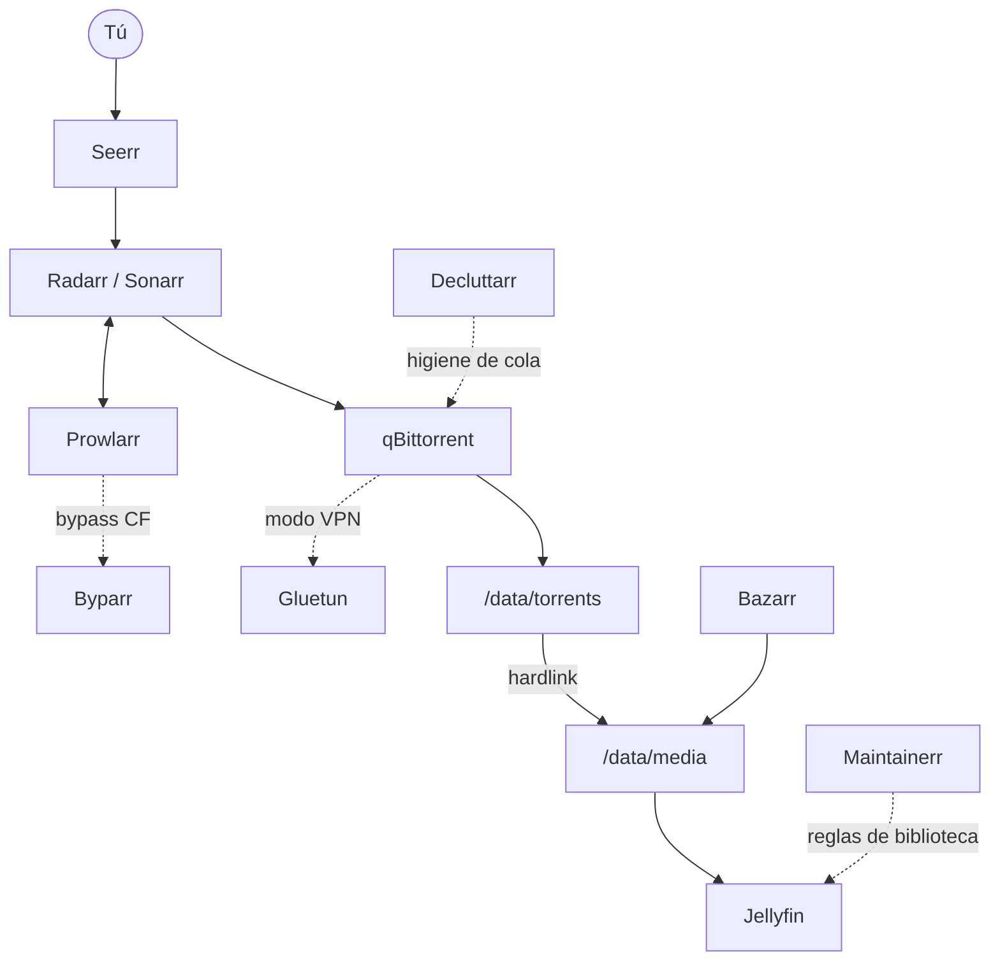
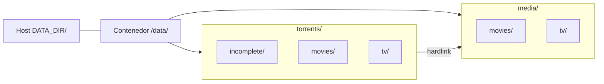
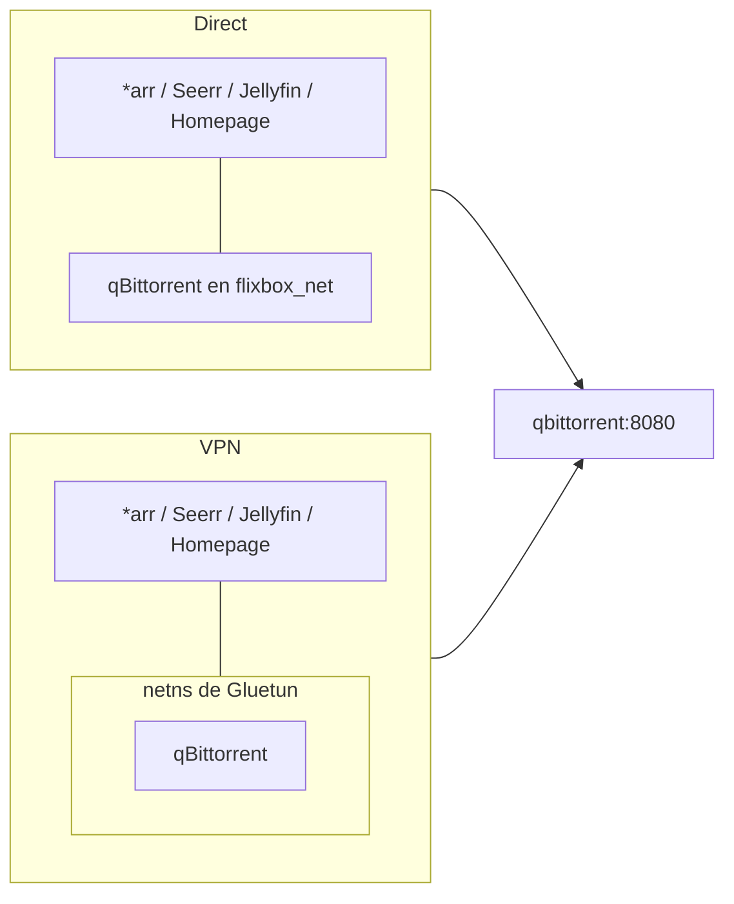

# Cómo funciona

**Idiomas:** [English](../../user/02-how-it-works.md) · Español (esta página)

Esta página es el modelo mental. Si lo entiendes, el resto de la configuración en la UI tiene sentido.

## Pipeline

Estilo del diagrama: [Documentation style guide — §7](../../00-doc-style.md#7-diagram-style-line).

1. **Solicitas** algo en Seerr (o lo agregas en Radarr/Sonarr).
2. La **búsqueda** pasa por Prowlarr. Los indexers protegidos por Cloudflare (por ejemplo 1337x) necesitan el proxy **Byparr** en Prowlarr — ver [First-run setup](05-first-run.md#1-prowlarr--byparr).
3. La **descarga** llega a `/data/torrents/...` vía qBittorrent (Direct, o a través de Gluetun en modo VPN).
4. La **importación** crea un **hardlink** en `/data/media/...` (el mismo archivo, segundo nombre — casi sin disco extra).
5. **Reproduces** desde Jellyfin; Bazarr puede obtener subtítulos.
6. Las herramientas de **higiene** evitan que colas y bibliotecas se pudran.

## Qué sincroniza Prowlarr (y qué no)

Prowlarr es el **hub de indexers**. Cuando conectas Radarr y Sonarr en **Settings → Apps**, empuja **solo indexers** a esas apps.

| Sincroniza de Prowlarr → Radarr/Sonarr | **No** sincroniza — configura en cada app |
| --- | --- |
| Indexers (Torznab/Newznab, etc.) | **Clientes de descarga** (qBittorrent) |
| Tags de indexer (si los usas) | **Root folders** (`/data/media/...`) |
| | **Perfiles de calidad** (usa Recyclarr después) |
| | **Jellyfin**, Seerr, rutas, API keys de *arr |

Así que qBittorrent se agrega **una vez en Radarr** y **una vez en Sonarr** en **Settings → Download Clients**. Mismo host (`qbittorrent`), puerto `8080`, se prefiere la **API key de qBit** (no tu contraseña de WebUI). Hasta que qBit 5.x escriba la key en la config, `configure` puede caer al password de WebUI — vuelve a ejecutar `configure` cuando aparezca la key. Decluttarr usa usuario/contraseña de qBit en `.env` en su lugar.

Para cómo se conecta cada app (Prowlarr, Seerr, Bazarr, Maintainerr, etc.), ver [Credentials and API keys](06-configuration.md#credentials-and-api-keys) y [App-to-app connections](06-configuration.md#app-to-app-connections). Paso a paso: [First-run §3](05-first-run.md#3-radarr--sonarr).

## Por qué importa un solo mount `/data`

Todas las apps de descarga y biblioteca deben ver la **misma carpeta padre** dentro del contenedor (`/data`). Si torrents y media son mounts Docker separados, los hardlinks fallan y *arr cae a una **copia** completa (lento, duplica disco mientras siembras).

Mantén torrents + media en **un solo filesystem**. Las bases de datos de config viven aparte bajo `${CONFIG_DIR}` en un **SSD/NVMe local** (no NFS/SMB).

## Modo VPN vs modo Direct

Elige con **`FLIXBOX_MODE`** (`direct` o `vpn`). Ese es el único switch de Compose. Mantén **`VPN_ENABLED`** alineado (`false` / `true`) como etiqueta — Compose no lo lee. Los modos son exclusivos (no Direct + Gluetun para qBit). Detalles: [VPN and Direct](07-vpn-and-direct.md).

Ambos modos mantienen el cliente de descarga en **`qbittorrent:8080`**. Solo qBit entra al netns de Gluetun en modo VPN — *arr y Jellyfin se quedan en la red Docker normal.

| Modo | Cuándo usarlo | Qué está protegido |
| --- | --- | --- |
| **VPN** (`FLIXBOX_MODE=vpn`) | Quieres enmascarar el tráfico torrent | Solo **qBittorrent** comparte la red de Gluetun |
| **Direct** (`FLIXBOX_MODE=direct`) | Trackers privados / máxima velocidad / sin VPN | qBittorrent en la red Docker normal; Gluetun no se inicia |

**Importante:** Radarr, Sonarr, Seerr, Jellyfin, etc. se quedan en la red normal. Ponerlos detrás de la VPN rompe metadatos y el acceso LAN.

En modo VPN, los peers del stack alcanzan qBittorrent en `http://qbittorrent:8080` (alias Docker en Gluetun — mismo hostname que Direct).
En modo Direct, usan la misma URL en el servicio `qbittorrent`.

Expectativas de privacidad, ajustes de qBit y checklist de fugas: [Torrent privacy and security](12-torrent-privacy-and-security.md).
Cuando cae el túnel (heal vs recreate): [Future planning — VPN resilience](../../11-future-notifications-and-vpn-resilience.md).

## Higiene en una frase

- **Decluttarr** — “esta descarga está muerta; quítala e intenta otra.”
- **Maintainerr** — “nadie vio esto en meses; avisa y luego limpia.”

Los defaults están documentados en [Hygiene](08-hygiene.md) y [engineering defaults](../../09-hygiene-defaults.md).

## Siguiente

[Requirements](03-requirements.md) → [Install](04-install.md).
