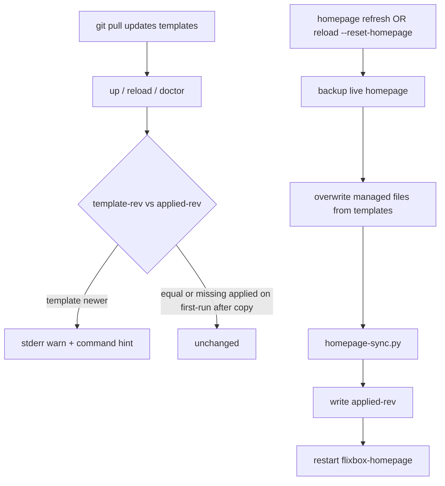

# Plan: Homepage template refresh (warn + opt-in apply)

- **Status:** Phase A implemented (2026-09-07)
- **Date:** 2026-09-07
- **ADR:** Not required — operator UX / day-2 lifecycle; no architecture contract change
- **Related:** ADR 0015 (Homepage not auth boundary), ADR 0021 (CLI UX: safe-by-default, lifecycle), C-86 (`homepage-sync`), C-88 (template refresh), `copy_templates` in `bin/flixbox`
- **Constraint:** Ship as a **complete vertical slice**, not drive-by patches to `copy_templates`

## Problem

`git pull` updates `templates/homepage/**`. `up` / `reload` / `init` only **copy-if-missing** into `${CONFIG_DIR}/homepage/`. Existing installs keep stale `services.yaml`, `custom.css`, `custom.js`, images, etc.

`homepage-sync.py` then mutates the **old** live files (ports, chips, secrets) — it does not bring new layout, status dots, brand CSS, or icons.

Operators who pull + reload reasonably expect “updated Homepage” and see the old dashboard. That is a product footgun, not a docs-only issue.

## Goals

1. **Detect** when shipped Homepage templates are newer than what was last applied to live config.
2. **Warn** on common lifecycle commands with an actionable command line.
3. **Apply** only on explicit opt-in: backup → overwrite managed files → sync → stamp → restart Homepage.
4. **Preserve** operator customizations by default (never silent overwrite).
5. **Document** upgrade path in REFERENCE + troubleshooting + release notes checklist.
6. **Gate** behavior with CI (contract + unit/smoke), ShellCheck-clean.

## Non-goals

- Auto-merge or three-way merge of YAML/CSS.
- Overwriting Homepage on every `reload`.
- New ADR (unless a future decision forces auto-overwrite or merge).
- Reworking Homepage app image pins (ADR 0010) or `homepage-sync` credential semantics.
- Implementing full `flixbox update` (ADR 0021 Phase B) in this plan — only hook a warn *when* `update` lands later.
- Spanish doc mirror (canonical EN first; ES REFERENCE line MAY follow in a follow-up).

## Principles

1. **Safe by default** (ADR 0021): mutate live Homepage only with an explicit verb/flag.
2. **Template revision ≠ file diff:** stamp tracks *shipped template generation*, not “live equals template” (avoids perpetual nag after local edits).
3. **One apply path:** `homepage refresh` and `reload --reset-homepage` share the same lib function.
4. **Backup before overwrite:** timestamped copy under `${CONFIG_DIR}/homepage.bak.<UTC>` (or sibling dir); never delete without backup.
5. **Sync after copy:** always run `homepage-sync.py` so ports/creds/chips/`shared` stripping stay correct.
6. **One behavioral change ⇒ docs + CI** (`docs/05-standards.md`).



---

## Design

### 1. Revision stamps

| Location | Purpose |
| --- | --- |
| `templates/homepage/.flixbox-template-rev` | Integer (or single-line token) bumped when **any** managed Homepage template that refresh overwrites changes in a release-worthy way |
| `${CONFIG_DIR}/homepage/.flixbox-applied-rev` | Last successfully applied template rev |

**Rules:**

- File content: one line, trimmed, non-empty (e.g. `4`). Prefer **monotonic integer** over git hash (stable across shallow clones / release tarballs).
- First-run `copy_templates`: after creating Homepage files, **also** copy/write `applied-rev = template-rev` so fresh installs do not warn.
- Existing installs without `applied-rev`: treat as **stale relative to current template-rev** → warn once on lifecycle (do not auto-apply). Optional: if live tree is byte-identical to templates for all managed files, stamp without warn (nice-to-have; not required for v1).
- Bumping `template-rev` is **required** in any PR that changes managed Homepage templates in a user-visible way. CI fails if templates change and rev did not.

### 2. Managed file set (overwrite list)

Refresh **must** overwrite exactly this set (and only this set):

- `services.yaml`, `settings.yaml`, `widgets.yaml`, `bookmarks.yaml`, `docker.yaml`
- `custom.css`, `custom.js`
- `images/logo.png`, `images/background.jpg`
- `.flixbox-template-rev` is **not** stored live; live stores `.flixbox-applied-rev` only

**Do not** overwrite arbitrary extra files the operator added under `${CONFIG_DIR}/homepage/` (e.g. custom icons). Backup captures the whole directory for recovery; apply only replaces the managed set.

### 3. CLI surface

| Interface | Behavior |
| --- | --- |
| `./bin/flixbox homepage refresh [--dry-run]` | Primary verb. Backup + overwrite managed set + sync + stamp + restart Homepage. `--dry-run`: print planned actions, no writes. |
| `./bin/flixbox reload [--reset-homepage] [profiles…]` | Existing reload; with `--reset-homepage`, run the **same** refresh function before/within reload after `copy_templates` warn path. |
| Warn on | `up`, `reload` (without reset), and `doctor` when present; if `doctor` not shipped yet, `status` MAY show one line. Prefer not to spam `configure`. |

**Help / messaging (stderr):**

```text
Homepage templates are newer than live config (applied=… template=…).
Live files were not overwritten (preserves local edits).
Apply:  ./bin/flixbox homepage refresh
Or:     ./bin/flixbox reload --reset-homepage
Backup will be written under ${CONFIG_DIR}/homepage.bak.<timestamp>
```

Outcome vocabulary (ADR 0021): `unchanged` / `updated` / `failed` / `skipped` on the refresh path.

**Exit codes:** refresh failure (backup/copy/sync/restart) → non-zero (Docker/restart failure → treat as compose/runtime, ideally taxonomy 3 when Phase A taxonomy exists; until then consistent non-zero + clear stderr is enough).

### 4. Library shape (no patch spaghetti)

New focused helper, e.g. `scripts/lib/homepage-templates.sh`:

- `flixbox_homepage_template_rev` / `flixbox_homepage_applied_rev`
- `flixbox_homepage_templates_stale` → 0/1
- `flixbox_homepage_warn_if_stale` → stderr only
- `flixbox_homepage_refresh [--dry-run]` → backup, copy managed set, sync, stamp, restart

`bin/flixbox`:

- `copy_templates` remains copy-if-missing for first paint; **adds** stamp write on first create; **calls** `warn_if_stale` from `cmd_up` / `cmd_reload`.
- New `cmd_homepage` with subcommand `refresh` (reject unknown subcommands → usage exit 2 when taxonomy lands).
- `cmd_reload` parses `--reset-homepage` before profile args.

Do **not** scatter `cp` lists in three places — single managed-file list in the lib.

### 5. Docs

| Doc | Change |
| --- | --- |
| `docs/user/REFERENCE.md` | Commands table: `homepage refresh`, `reload --reset-homepage` |
| `docs/user/10-troubleshooting.md` | Row: “Homepage looks old after git pull” → refresh |
| `docs/user/06-configuration.md` | Short note under Homepage / after `.env` port sync |
| `docs/releases/*` checklist | “If `templates/homepage` changed: bump `.flixbox-template-rev`; mention Upgrade note” |
| `docs/10-ci-plan.md` | New check id (e.g. C-88) description |

### 6. CI / validation

| Check | Assert |
| --- | --- |
| C-88 (new) | `.flixbox-template-rev` exists and is a single integer line |
| C-88 | `homepage-templates.sh` (or equivalent) exists; `bin/flixbox` wires `homepage refresh` and `reload --reset-homepage` |
| C-88 | Managed file list in lib matches files present under `templates/homepage/` for the overwrite set |
| C-88 | Unit: temp `CONFIG_DIR` with old applied-rev → `warn_if_stale` emits hint; after refresh → revs equal; second refresh → `unchanged` or no-op stamp |
| C-88 | If git diff touches managed templates without rev bump → fail (scripted heuristic in `ci-validate.sh`) |
| Existing | ShellCheck on new lib; `ci-smoke-init` first-run leaves applied-rev set (no false warn on fresh init) |

---

## Implementation phases (complete slices)

Ship **Phase A** as the usable product. Phase B is hardening, not a substitute for A.

### Phase A — Detect, warn, apply (blocking)

1. Add `templates/homepage/.flixbox-template-rev` (start at `1`).
2. Implement `scripts/lib/homepage-templates.sh` (rev, warn, refresh+backup+sync+stamp+restart).
3. Wire `flixbox homepage refresh [--dry-run]` and `flixbox reload --reset-homepage`.
4. Warn from `up` / `reload` when stale.
5. First-run `copy_templates` stamps `applied-rev`.
6. Docs: REFERENCE + troubleshooting (+ short config note).
7. CI C-88 + ShellCheck.

**Done when:** an existing install with old live Homepage, after `git pull` that bumped rev, sees warn on `reload` and recovers fully via `homepage refresh` (dots, CSS, logo, chips) without hand `cp`.

### Phase B — Hardening (same feature, not a different design)

1. `doctor` / `status` one-liner when stale (if those surfaces exist).
2. Optional identical-tree auto-stamp for upgrades that never customized.
3. Hook warn into future `flixbox update` (ADR 0021 Phase B) without implementing `update` here.
4. ES REFERENCE one-liner.
5. Retention policy for `homepage.bak.*` (e.g. keep last N) — document default “keep forever until operator deletes”.

---

## Multi-role audit

### Operator (day-2 homelab)

| Question | Verdict |
| --- | --- |
| Will pull+reload alone update Homepage UI? | **No** — warn explains why; command is copy-pasteable |
| Can I lose custom widgets by accident? | **No** — only explicit refresh/reset; backup first |
| Is the warn noisy? | Only when template-rev advances; silenced after refresh even if I edit YAML later |
| First install? | No warn; stamp written at copy |

**Risk:** Operator customized `services.yaml` heavily → refresh overwrites. Mitigated by backup path in the warn and docs (“diff against `homepage.bak.*`”).

### Maintainer / contributor

| Question | Verdict |
| --- | --- |
| When do I bump rev? | Any user-visible change under managed Homepage templates |
| Can I forget? | CI C-88 fails template churn without rev bump |
| ADR needed? | **No** for this design; revisit only if auto-overwrite is proposed |

### CI / QA

| Question | Verdict |
| --- | --- |
| Covered without live stack? | Yes — temp dirs + unit asserts |
| Live-stack flake? | Refresh restart needs Docker; dry-run and stamp logic testable without Homepage container; restart failure must be visible |
| Regression on copy-if-missing? | First-run still creates files; stamp added |

### Security / LAN trust (ADR 0015 / 0018)

| Question | Verdict |
| --- | --- |
| Does refresh re-inject admin secrets under `shared`? | Refresh copies templates then **must** run `homepage-sync`, which strips admin widgets under `shared` — same as today |
| Backup dir permissions? | Create backup with same umask/ownership expectations as `CONFIG_DIR` (no world-readable secrets if `services.yaml` had keys under `trusted`) |
| Secrets in warn text? | Never print API keys/passwords; only revs and command hints |

### Support / docs

| Question | Verdict |
| --- | --- |
| Discoverable? | REFERENCE + troubleshooting row + CLI `--help` |
| Release process? | Upgrade bullet when rev bumps |

### Product / scope

| Question | Verdict |
| --- | --- |
| In v0.1 core inventory? | Yes — Homepage is baseline; this is ops around an existing service |
| Scope creep? | Avoid YAML merge, Authelia, Homepage auth — out of scope |

---

## Validation matrix (acceptance)

| ID | Scenario | Expected |
| --- | --- | --- |
| V1 | Fresh `init` + `up` | Homepage from templates; `applied-rev == template-rev`; no stale warn |
| V2 | Old live config, bump template-rev, `reload` | Warn on stderr; live files unchanged |
| V3 | V2 then `homepage refresh` | Backup exists; managed files match templates; sync applied; stamp updated; Homepage restarted; UI shows new assets |
| V4 | Second `homepage refresh` immediately | Idempotent success (`unchanged` or no harmful rewrite); stamp unchanged |
| V5 | `reload --reset-homepage` | Same end state as V3 |
| V6 | `homepage refresh --dry-run` | No backup/copy/stamp/restart; prints plan |
| V7 | `FLIXBOX_ACCESS_PROFILE=shared` + refresh | Admin widget blocks absent after sync |
| V8 | PR changes `custom.css` without rev bump | `ci-validate` C-88 fails |
| V9 | ShellCheck on new scripts | Clean at CI `-S warning` |

---

## Rollout

1. Land Phase A on `main` with `template-rev=1` and stamp-on-first-copy.
2. Next Homepage visual/layout PR bumps to `2` and includes an Upgrade note: run `homepage refresh`.
3. Do not rewrite history of existing `CONFIG_DIR` in CI runners beyond smoke temps.

## Open decisions (resolve in implementation PR, not by ADR)

| Topic | Recommendation |
| --- | --- |
| Command nesting | `flixbox homepage refresh` (extensible) vs only `reload --reset-homepage` — **both** (plan assumes both) |
| Backup location | `${CONFIG_DIR}/homepage.bak.<UTC>` sibling — simple, visible |
| Warn on `configure` | **No** for v1 (noise); `up`/`reload`/`status` enough |

## Explicitly rejected

- Silent overwrite on `reload`
- “Always rsync templates” without stamp/warn
- Storing full template tarball in git LFS
- ADR for this feature alone

---

## Implementation checklist (when executing)

- [x] `templates/homepage/.flixbox-template-rev`
- [x] `scripts/lib/homepage-templates.sh`
- [x] `bin/flixbox` — `cmd_homepage`, reload flag, warn hooks, first-run stamp
- [x] Docs: REFERENCE, troubleshooting, config note, CI plan C-88
- [x] `scripts/ci-validate.sh` C-88 + smoke stamp behavior
- [x] Local: ShellCheck + `ci-validate`
- [ ] No commit until operator asks

## Success definition

After `git pull` of a Homepage-touching release, an operator who only runs `reload` **learns** they are stale and recovers with **one documented command**, without reading Discord tribal knowledge and without Flixbox destroying customizations by default.
