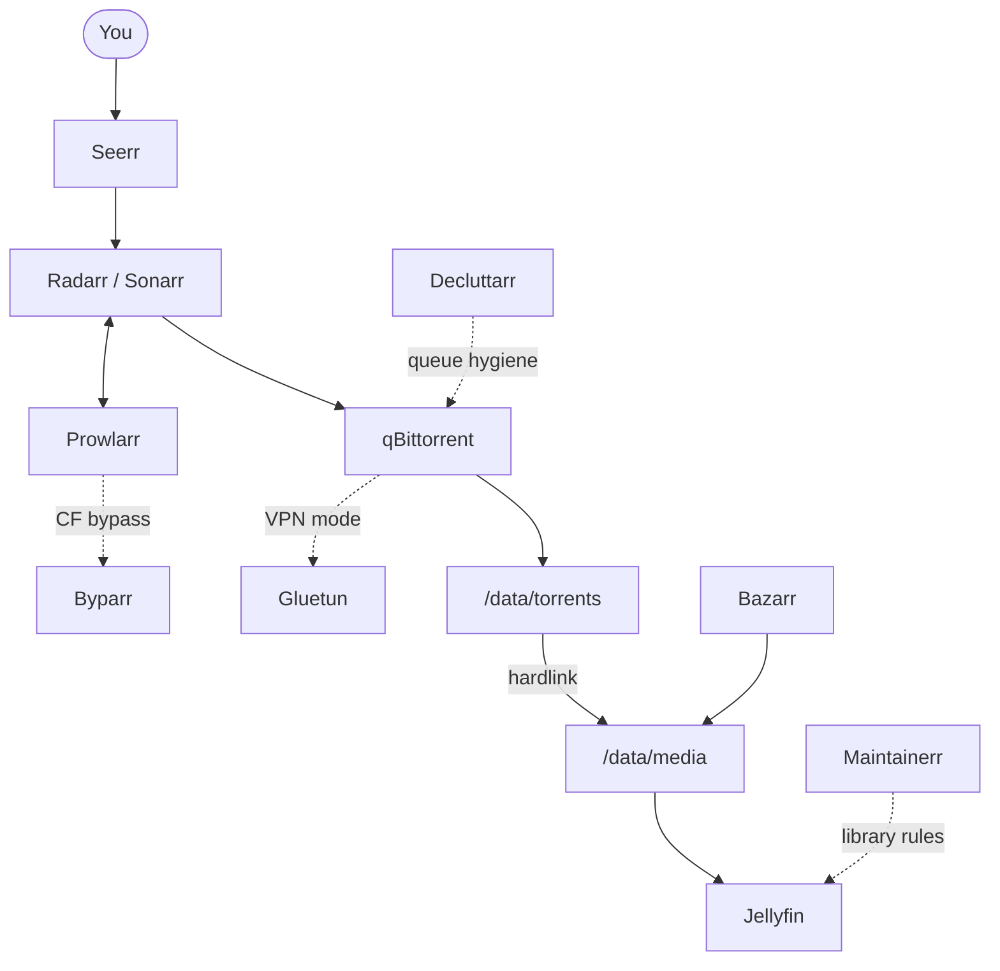
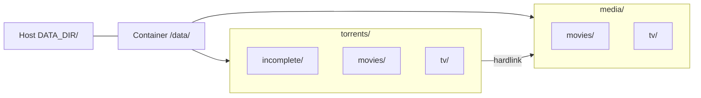
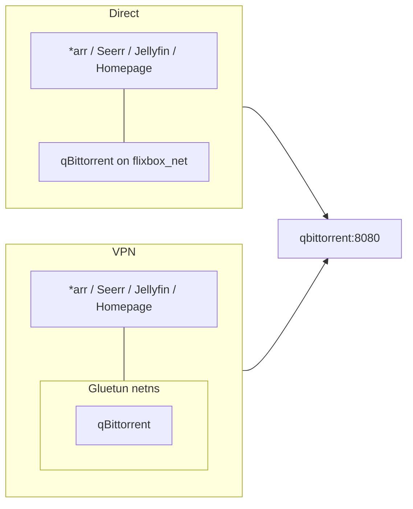

# How it works

This page is the mental model. If you understand it, the rest of the UI setup makes sense.

## Pipeline

Diagram style: [Documentation style guide — §7](../00-doc-style.md#7-diagram-style-line).

1. **Request** something in Seerr (or add it in Radarr/Sonarr).
2. **Search** goes through Prowlarr. Cloudflare-protected indexers (for example 1337x) need the **Byparr** proxy in Prowlarr — see [First-run setup](05-first-run.md#1-prowlarr--byparr).
3. **Download** lands in `/data/torrents/...` via qBittorrent (Direct, or through Gluetun in VPN mode).
4. **Import** creates a **hardlink** into `/data/media/...` (same file, second name — almost no extra disk).
5. **Stream** from Jellyfin; Bazarr can fetch subtitles.
6. **Hygiene** tools keep queues and libraries from rotting.

## What Prowlarr syncs (and what it does not)

Prowlarr is the **indexer hub**. When you connect Radarr and Sonarr under **Settings → Apps**, it pushes **indexers only** to those apps.

| Syncs from Prowlarr → Radarr/Sonarr | Does **not** sync — configure in each app |
| --- | --- |
| Indexers (Torznab/Newznab, etc.) | **Download clients** (qBittorrent) |
| Indexer tags (if you use them) | **Root folders** (`/data/media/...`) |
| | **Quality profiles** (use Recyclarr later) |
| | **Jellyfin**, Seerr, paths, API keys for *arr |

So qBittorrent is added **once in Radarr** and **once in Sonarr** under **Settings → Download Clients**. Same host (`qbittorrent`), port `8080`, **qBit API key** preferred (not your WebUI password). Until qBit 5.x writes the key to config, `configure` may fall back to the WebUI password — re-run `configure` after the key appears. Decluttarr uses qBit username/password in `.env` instead.

For how every app connects (Prowlarr, Seerr, Bazarr, Maintainerr, etc.), see [Credentials and API keys](06-configuration.md#credentials-and-api-keys) and [App-to-app connections](06-configuration.md#app-to-app-connections). Step-by-step: [First-run §3](05-first-run.md#3-radarr--sonarr).

## Why one `/data` mount matters

All download and library apps must see the **same parent folder** inside the container (`/data`). If torrents and media are separate Docker mounts, hardlinks fail and *arr falls back to a full **copy** (slow, doubles disk while seeding).

Keep torrents + media on **one filesystem**. Config databases live separately under `${CONFIG_DIR}` on a **local SSD/NVMe** (not NFS/SMB).

## VPN mode vs Direct mode

Pick with **`FLIXBOX_MODE`** (`direct` or `vpn`). That is the only Compose switch. Keep **`VPN_ENABLED`** aligned (`false` / `true`) as a label — Compose does not read it. Modes are exclusive (no Direct + Gluetun for qBit). Details: [VPN and Direct](07-vpn-and-direct.md).

Both modes keep the download client at **`qbittorrent:8080`**. Only qBit enters Gluetun’s netns in VPN mode — *arr and Jellyfin stay on the normal Docker network.

| Mode | When to use | What is protected |
| --- | --- | --- |
| **VPN** (`FLIXBOX_MODE=vpn`) | You want torrent traffic masked | Only **qBittorrent** shares Gluetun’s network |
| **Direct** (`FLIXBOX_MODE=direct`) | Private trackers / max speed / no VPN | qBittorrent on the normal Docker network; Gluetun not started |

**Important:** Radarr, Sonarr, Seerr, Jellyfin, etc. stay on the normal network. Putting them behind the VPN breaks metadata and LAN access.

In VPN mode, stack peers reach qBittorrent at `http://qbittorrent:8080` (Docker alias on Gluetun — same hostname as Direct).
In Direct mode, they use the same URL on the `qbittorrent` service.

Privacy expectations, qBit settings, and leak checklist: [Torrent privacy and security](12-torrent-privacy-and-security.md).
When the tunnel drops (heal vs recreate): [Future planning — VPN resilience](../11-future-notifications-and-vpn-resilience.md).

## Hygiene in one sentence

- **Decluttarr** — “this download is dead; remove it and try another.”
- **Maintainerr** — “nobody watched this in months; warn, then clean up.”

Defaults are documented in [Hygiene](08-hygiene.md) and [engineering defaults](../09-hygiene-defaults.md).

## Next

[Requirements](03-requirements.md) → [Install](04-install.md).
